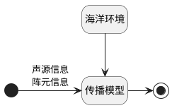

* 阅读了几篇关于系统框架的论文

- 结合论文，重新梳理了样机系统框架

---

### 论文内容概括：

> 研究水声仿真算法和参数结构，设计开发软件框架，应用水声知识进行系统开发。

 * 三个侧重点：
 
	（1）仿真框架结构建立
	
	（2）系统的可重用性和可扩充性研究
	
	（3）声场仿真模型对象研究
	
考虑了框架设计以及对应接口，缺乏细节性功能的实现

>论文针对声场仿真进行分析以及归类对象，有助于编写样机系统环境信息管理中环境文件存储格式以及编码封装

---

### **具体思路**

声场仿真一般处理模型：



也就是包括5个部分：

&emsp;（1）声源信息
&emsp;（2）阵元信息
&emsp;（3）海洋环境信息
&emsp;（4）算法模型
&emsp;（5）声场信息

样机系统中环境文件管理需要部分为（1）（2）（3），则忽略（4）和（5）

---

#### **1、声源信息**

&emsp;  freq  &emsp;  depth  &emsp;  num  &emsp;  postion

#### **2、阵元信息**

&emsp;  水平分布 + 垂直分布

#### **3、海洋环境信息**

主要包括：

&emsp; 环境参数 + 计算规则
    
计算规则类似于bellhop等，比如
	1. 海面海底边界条件
	2. 接收点在水平距离和垂直距离位置分布
	3. 分层介质的分布信息
其中分层介质分布信息设计两个方案，二维或者三维

* 二维下
```
深度    声速    密度    吸收系数
…
```

优点是通用性强，实现简单，但不适用于有方位变化的问题

* 三维下
```
方位角theta1
    距离r1    海深d1    层次数L1
        分层l1    离散数N1
            深度z1    声速c1    密度rou1    吸收系数alph1
            深度z2    声速c2    密度rou2    吸收系数alph2
        分层l2    离散数N2
            …
    距离r2    海深d2    层次数L2
        …
方位角theta2
    …
```

优点是能适用于复杂问题，但是实现具有一定难度

