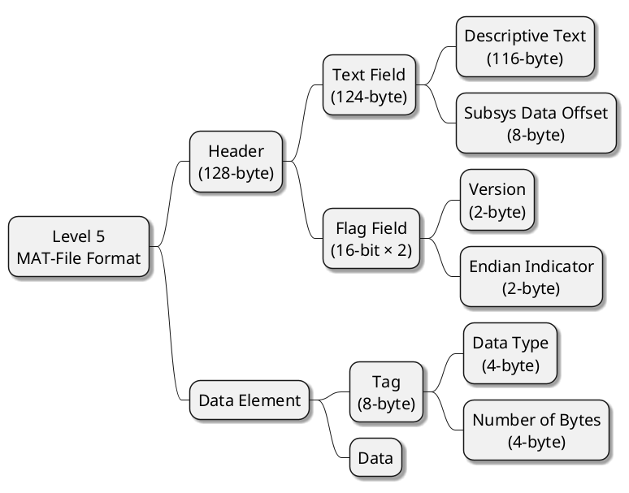
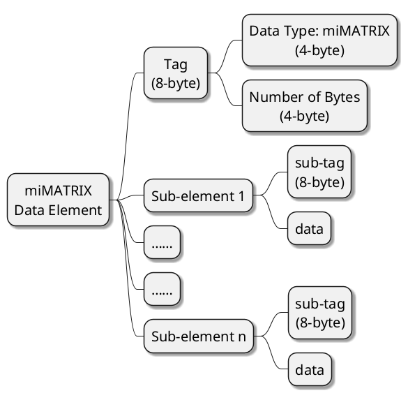

*@DATE: 2023/03/01 10:40:02*
*@Version: 1.0*

---

## 1. 引言

MAT 文件中，将数据存储为二进制的形式。

《MAT-File Format》文档从big-endian的视角提供了关于如何单独在系统中读写 MAT 文件的细节。文档描述包括 Level 5 和 Level 4 两种MAT文件格式，Level 5 MAT 文件支持包括多维数值数组、字符数组、稀疏数组、单元格数组、结构和对象。Level 4 MAT 文件格式只支持二维矩阵和字符串。

本文档主要从《MAT-File Format》文档中摘取 Level 5 MAT 文件格式的部分写成。

---

## 2. 背景知识

    1 Byte (字节) = 8 bit (位)
    1 KB = 1024 B = 8192 bit
    
    16 bit = 2 Byte
    32 bit = 4 Byte

---

## 3. Level 5 文件格式



---

### 3.1 Header 格式

**Header 部分**由 124-byte 的**文本字段**以及 2 个 16-bit (2个2字节) 的**标志字段**组成。对于 Header 部分包含的 128-byte 信息中：

1. 前 116-byte 可以包含**可读形式的文本数据**。该文本通常提供描述 MAT 文件创建方式的信息，比如:
    
    - MAT文件级别
    - 创建文件的平台
    - 创建文件的日期和时间

    ```
    MATLAB 5.0 MAT-file, Platform: SOL2, Created on: Thu Nov 13
    10:10:27 1997
    ```

2. 随后的 8-byte (第117 ~ 124-byte) 包含MAT文件中**子系统特定数据的偏移量**。此字段中的所有零或所有空格表示文件中没有存储子系统特定数据。

3. 最后 4-byte (第125 ~ 128-byte) 分为2个 16-bit 的**标志字段** (int16) 。

    - 第一个 2-byte 为 **Version** 标志，创建MAT文件时，设置此字段为 0x0100 
        
        > 0x0100 = 0000 0001 0000 0000
		> 
        > 2-byte = 16-bit

    - 第二个 2-byte 为 **Endian Indicator** (尾部指示器) 标志，包含两个字符 M 和 I，作为 16 位值按此顺序 (MI) 写入 MAT 文件。如果以 16 位值从 MAT 文件读取时，字符以相反的顺序 (IM) 出现，则表示读取 MAT 文件的程序必须执行字节交换才能正确解释 MAT 文件中的数据。

---

### 3.2 Data Element 格式

每一个 **Data Element 部分**由 8-byte 的 **Tag 字段**以及存储的 **Data 数据**组成。

一般来讲，一个 Data Element 字段的长度可以表示为：

$$
\begin{aligned}
     Length(Data\ Element) & = Tag 字段的长度 + Data 字段的长度 \\ 
                          & = Tag字段的长度 + Number\ of\ Byte 的数值 × Data\ Type 中的类型所表示的长度 \\
\end{aligned}
$$

#### Tag 字段

**Tag 字段**定义了 Data Element 中数据的类型 (Data Type) 以及数据所占的字节数量 (Number of Bytes)。 Tag 标签的使用可以达成在MAT文件中对数据元素的快速访问（方法：遍历）

- **Data Type** 中指定了元素中的数据大小和数据类型，字段大小为 32-bit (4-byte)。 MAT 文件格式支持多种数据类型，包括有符号和无符号、8 位、16 位、32 位和 64 位数据类型、一种表示 MATLAB 数组的特殊数据类型、Unicode®编码字符数据以及以压缩格式存储的数据。
- **Number of Bytes** 字段指定了元素中数据的字节数，字段大小为 32-bit (4-byte)。**该字段的值不包括 Tag 标签的 8-byte。**

#### Data 字段

**Data 字段**在 Tag 字段之后，所有未压缩的数据都必须在 64 位边界上对齐。 编写 MAT 文件时，如果数据元素中的数据量未达到 64 位边界，则必须添加填充字节以确保下一个数据元素的标记落在 64 位边界上。 同样，从 MAT 文件读取数据时，请务必考虑这些填充字节。

> **Note:** 对于表示 MATLAB 数组的数据元素，Number of Bytes 字段的值包括总计的填充字节。对于所有其他MAT文件数据类型，字节数字段的值不包括填充字节。

- **小数据元素格式：** 如果 Data 数据元素只占了 1~4-byte，则 Matlab 存储数据时使用 8-Byte 的格式来节省空间。此时 Data Type 以及 Number of Bytes 字段存储为各占 16-bit 的值，Data 字段则占 4-byte。

    > **注意：** 读取 MAT 文件时，可以通过比较标记的前 2 个字节的值与值零 (0) 来判断是否正在处理一个小数据元素。如果这 2 个字节不为零，则标记使用小数据元素格式。当写入 MAT 文件时，可以选择使用小数据元素格式。


### 3.3 特殊数据元素格式：Array Data Element 格式

MAT 文件格式中，使用 miMATRIX 表示所有类型的 MATLAB 数组 (包括：数值数组、字符数组、稀疏矩阵、元胞数组、结构体、对象)

> miMATRIX 为复合数据类型，包括多个任意的其他 MAT 文件数据类型子元素，甚至包括同类 miMATRIX 类型



每个 miMATRIX 数据元素都包含一组特定的子元素，以下各小节将介绍每种 MATLAB 数组类型的子元素。

#### 数值数组和字符数组元素

组成：4 种子元素 + 1 种可选子元素

1. Array Flags Subelement

2. Dimensions Array

3. Array Name

4. Real part (pr)

5. Imaginary part (pi) (Optional)


#### 稀疏矩阵元素

#### 元胞数组元素

#### 结构体元素

#### 对象 MAT-File 数据元素 